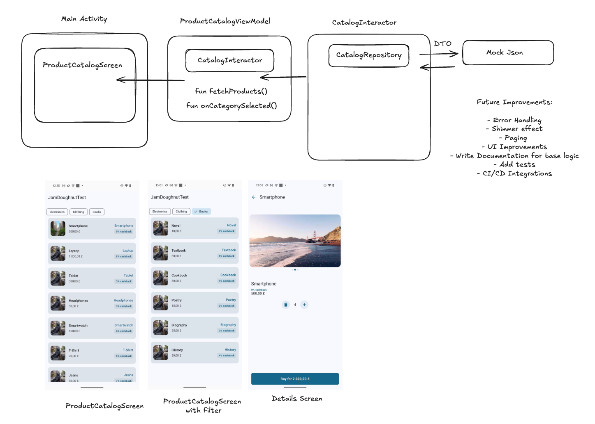

# JamDougnut Test

This is the architecture of the project:

* Created all necessary UI using Jetpack Compose
* Added new Composable ProductDetailsScreen and CatalogScreen
* Cover domain logic by unit tests. Created test: ProductDetailsInteractorTest
* Created the structure of the project into 3 parts: data, domain and presentation. Added feature packages. For example catalog, product_details etc.
* Data package consists of: dto, models, repository implementation
* Domain package consists of: Interactors, Repositories

## The project consists of
* Presentation layer (all UI classes and ViewModel)
* Domain layer (Interactors and Repository interfaces)
* Data layer (Data Transfer Object (DTO) and repository implementations)
* Utils package

## Libraries
Hilt for DI
Kotlin Coroutnies for reactive stream
Kotlinx.Serialization for JSON
Mockito, Junit for Unit tests

  